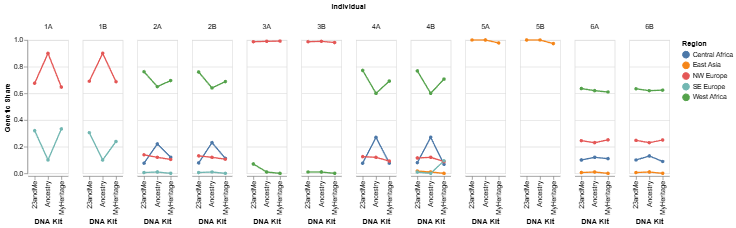
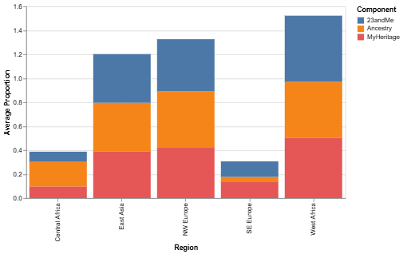
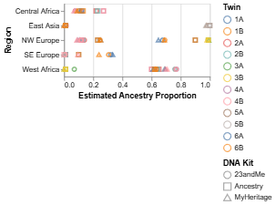

[Home](../)

```{ojs}
//| echo: false
embed = require("vega-embed@6")
```

## Exercise 1 

{width=100%}

{width=100%}

**a)** I personally liked the #2 graph. The "Comparing twins" section uses bar charts that are faceted. The Twin ID is encoded by color. By aligning them side by side it is easy to compare perceptually. The "Comparing kits" uses line hows how genetic share values moves across kits for each region. The facets make it look organized.

{width=50%}

{width=50%}

**b)** The #7 is graph is misleading. The stacked bars shows the proportions that exceed 1.0, which makes it hard to interpret any data from the graph. The scatter plot also encodes kit type using shape and colors, but the points are small and overlapping without any jitters, which makes it difficult to distinguish between kits and Twin type. 

**c)**
```{ojs}
//| code-fold: true

kits = {
  const spec = {
    "$schema": "https://vega.github.io/schema/vega-lite/v6.json",
    "data": {
      "url": "https://calvin-data304.netlify.app/data/twins-genetics-wide.csv"
    },
    "title": "Graph 1 Kit: 23andMe vs MyHeritage",
    "width": 300,
    "height": 300,
    "layer": [
      {
        "mark": {"type": "rule", "color": "lightgray"},
        "encoding": {
          "x": {"datum": 0},
          "y": {"datum": 0},
          "x2": {"datum": 1},
          "y2": {"datum": 1}
        }
      },
      {
        "mark": {"type": "circle", "size": 100, "opacity": 0.7},
        "encoding": {
          "x": {"field": "23andMe", "type": "quantitative", "title": "23andMe", "scale": {"domain": [0, 1]}},
          "y": {"field": "MyHeritage", "type": "quantitative", "title": "MyHeritage", "scale": {"domain": [0, 1]}},
          "color": {"field": "region", "type": "nominal", "title": "Region"},
          "tooltip": [
            {"field": "twin", "type": "nominal"},
            {"field": "region", "type": "nominal"},
            {"field": "23andMe", "type": "quantitative"},
            {"field": "MyHeritage", "type": "quantitative"},
            {"field": "Ancestry", "type": "quantitative"}
          ]
        }
      }
    ]
  };
  return embed(spec);
}
```

**Graph 1:** This scatter plot compares all results for individuals over all regions. The line represents where the two kits would give the same result. The closer the points are to the line means both kits have similar genetic share values. We can see that most points are clustered along the line, which menas two kits agree with the similar genetic share values. However, when ancestry proportions are small (below 0.3), we can notice that the points spread out more slightly, indicating that the kits tend to disagree more.

```{ojs}
//| code-fold: true

twins = {
  const spec = {
    "$schema": "https://vega.github.io/schema/vega-lite/v6.json",
    "data": {
      "url": "https://calvin-data304.netlify.app/data/twins-genetics-long.csv"
    },
    "title": "Graph 2: Twin Ancestry Comparison",
    "transform": [
      {"aggregate": [{"op": "mean", "field": "genetic share", "as": "mean_share"}],
       "groupby": ["twin", "pair", "id", "region"]}
    ],
    "layer": [
      {
        "mark": "rect",
        "encoding": {
          "x": {"field": "twin", "type": "nominal", "title": "Individual Twin",
                "sort": ["1A","1B","2A","2B","3A","3B","4A","4B","5A","5B","6A","6B"],
                "axis": {"labelAngle": 0}},
          "y": {"field": "region", "type": "nominal", "title": null},
          "color": {"field": "mean_share", "type": "quantitative",
                    "title": "Avg Genetic Share",
                    "scale": {"scheme": "blues"}}
        }
      },
      {
        "mark": {"type": "text", "fontSize": 10},
        "encoding": {
          "x": {"field": "twin", "type": "nominal",
                "sort": ["1A","1B","2A","2B","3A","3B","4A","4B","5A","5B","6A","6B"]},
          "y": {"field": "region", "type": "nominal"},
          "text": {"field": "mean_share", "type": "quantitative", "format": ".2f"},
          "color": {
            "condition": {"test": "datum.mean_share > 0.5", "value": "white"},
            "value": "black"
          }
        }
      }
    ],
    "width": 500,
    "height": 250
  };
  return embed(spec);
}
```

**Graph: 2** I tried making heatmap for the first time, with reference to the [Layering text over heatmap](https://vega.github.io/vega-lite/examples/layer_text_heatmap.html) Vega-Lite Gallery. This heat map shows avg genetic share over all 3 kits for each twin, positioned by different region. Both Twin A and B are aligned side by side to perceptually compare easily. The color patterns show that twins receive pretty consistent acestry estimates. The largest difference is at SE Europe, 0.25 <> 0.21 which is not a significant difference.

## Exercise 2

```{ojs}
//| code-fold: true

dvs_data = FileAttachment("set1_jobtitles.csv").csv()

dvs = {
  const spec = {
    "$schema": "https://vega.github.io/schema/vega-lite/v6.json",
    "data": {"values": dvs_data},
    "title": "How Data Viz Professionals Spend Their Time by Experience Level",
    "transform": [
      {"filter": "indexof(['1-5','6-10','11-15','16-20'], datum.YearsDataVizExperience_buckets) >= 0"},
      {"fold": ["TimeDataPrep", "TimeDataAnalysis", "TimeIdeating", 
                "TimeProducingViz", "TimeManagingDataViz"],
       "as": ["task", "hours"]},
      {"filter": "indexof(['5 hours or less','6–10 hours','11–20 hours','21–30 hours','More than 30 hours'], datum.hours) >= 0"}
    ],
    "width": 200,
    "height": 200,
    "mark": "bar",
    "encoding": {
      "x": {"field": "task", "type": "nominal", "title": null,
            "axis": {"labelAngle": -45}},
      "y": {"aggregate": "count", "title": "Proportion",
            "stack": "normalize",
            "axis": {"format": ".0%"}},
      "color": {"field": "hours", "type": "ordinal", "title": "Hours per Week",
               "sort": ["5 hours or less", "6–10 hours", "11–20 hours", 
                        "21–30 hours", "More than 30 hours"],
               "scale": {"scheme": "blues"}},
      "column": {"field": "YearsDataVizExperience_buckets", "type": "ordinal",
                "title": "Years of Experience",
                "sort": ["1-5", "6-10", "11-15", "16-20"]}
    }
  };
  return embed(spec);
}
```

I decided to do challenge #5 using a dataset from the Data Visualization Society survey. I made a stacked bar chart to compare time consumption among employees with different years of experience. Most people use 5 hours or less per task. As professionals get more experience, more time goes toward "Managing Data Viz". I selected five time-related columns and converted them to long format using a fold transform. I filtered out any empty or NA responses. I divided into four groups for Years of Experience to make it readable.

## Exercise 3

Data: [Tanzania.csv](Tanzania.csv)

For spanned two calendar years data, I just recorded the first year to make it simple and to easy to use.

```{ojs}
//| code-fold: true

tz_data = FileAttachment("Tanzania.csv").csv({typed: true})

tanzania = {
  const spec = {
    "$schema": "https://vega.github.io/schema/vega-lite/v6.json",
    "data": {"values": tz_data},
    "title": "Tanzania: Fertility vs Contraception vs Unmet Need (1991–2015)",
    "transform": [
      {"fold": ["fertility_rate", "contraception_pct", "unmet_need_pct"],
       "as": ["measure", "value"]}
    ],
    "width": 400,
    "height": 120,
    "mark": {"type": "line", "point": true},
    "encoding": {
      "x": {"field": "year", "type": "quantitative", "title": "Year",
            "axis": {"format": "d"}},
      "y": {"field": "value", "type": "quantitative", "title": null},
      "color": {"field": "measure", "type": "nominal", "title": null},
      "row": {"field": "measure", "type": "nominal", "title": null}
    },
    "resolve": {"scale": {"y": "independent"}}
  };
  return embed(spec);
}
```

I used a fold transform to convert the three columns into long format, then faceted by row with independent y-scales to show each trend. Looking at the graph, contraception use increased significantly from 6% to 38%, causing the fertility rate to drop from 6.2 to 5.2. However, unmet need for family planning did not see as much impact (28% > 22%) from the increase in contraception. This indicates that while contraception use grew, many women still have unmet need for family planning.

## Exercise 4

Data: [NBA.csv](NBA.csv)  Source: [Basketball Reference](https://www.basketball-reference.com/leagues/NBA_stats_per_game.html)

Place cursor on the points for details! 
```{ojs}
//| code-fold: true

nba_raw = FileAttachment("NBA.csv").csv()

nba = {
  let spec = {
    "$schema": "https://vega.github.io/schema/vega-lite/v6.json",
    "data": {"values": nba_raw},
    "title": "The NBA 3-Point Revolution",
    "transform": [
      {"calculate": "toNumber(datum['3PA'])", "as": "three_pa"},
      {"calculate": "toNumber(datum['3P'])", "as": "three_pm"},
      {"calculate": "toNumber(substring(datum.Season, 0, 4))", "as": "start_year"},
      {"filter": "isValid(datum.three_pa) && datum.three_pa > 0 && datum.start_year >= 1980"}
    ],
    "width": 550,
    "height": 300,
    "layer": [
        {
    "mark": {"type": "area", "opacity": 0.2, "color": "steelblue"},
    "params": [{"name": "grid", "select": "interval", "bind": "scales"}],
    "encoding": {
      "x": {"field": "start_year", "type": "quantitative", "title": "Year",
            "axis": {"format": "d"}},
      "y": {"field": "three_pa", "type": "quantitative", "title": "3PA per Game"}
    }
  },
      {
        "mark": {"type": "line", "point": true, "color": "steelblue"},
        "encoding": {
          "x": {"field": "start_year", "type": "quantitative"},
          "y": {"field": "three_pa", "type": "quantitative"},
          "tooltip": [
            {"field": "Season", "type": "nominal"},
            {"field": "three_pa", "type": "quantitative", "title": "3PA per Game"},
            {"field": "three_pm", "type": "quantitative", "title": "3PM per Game"}
          ]
        }
      },
      {
        "mark": {"type": "point", "color": "red", "size": 80, "filled": true},
        "data": {"values": [{"ax": 1994, "ay": 15.3}]},
        "encoding": {
          "x": {"field": "ax", "type": "quantitative"},
          "y": {"field": "ay", "type": "quantitative"}
        }
      },
      {
        "mark": {"type": "rule", "color": "red"},
        "data": {"values": [{"ax": 1994, "ay1": 15.3, "ay2": 30}]},
        "encoding": {
          "x": {"field": "ax", "type": "quantitative"},
          "y": {"field": "ay1", "type": "quantitative"},
          "y2": {"field": "ay2"}
        }
      },
      {
        "mark": {"type": "text", "align": "center", "dy": -10, "color": "red",
                 "fontWeight": "bold", "fontSize": 11},
        "data": {"values": [{"ax": 1994, "ay": 30}]},
        "encoding": {
          "x": {"field": "ax", "type": "quantitative"},
          "y": {"field": "ay", "type": "quantitative"},
          "text": {"value": "3PT line shortened"}
        }
      },
      {
        "mark": {"type": "point", "color": "green", "size": 80, "filled": true},
        "data": {"values": [{"ax": 2009, "ay": 18.1}]},
        "encoding": {
          "x": {"field": "ax", "type": "quantitative"},
          "y": {"field": "ay", "type": "quantitative"}
        }
      },
      {
        "mark": {"type": "rule", "color": "green"},
        "data": {"values": [{"ax": 2009, "ay1": 18.1, "ay2": 33}]},
        "encoding": {
          "x": {"field": "ax", "type": "quantitative"},
          "y": {"field": "ay1", "type": "quantitative"},
          "y2": {"field": "ay2"}
        }
      },
      {
        "mark": {"type": "text", "align": "center", "dy": -10, "color": "green",
                 "fontWeight": "bold", "fontSize": 11},
        "data": {"values": [{"ax": 2009, "ay": 33}]},
        "encoding": {
          "x": {"field": "ax", "type": "quantitative"},
          "y": {"field": "ay", "type": "quantitative"},
          "text": {"value": "Curry debut"}
        }
      }
    ]
  };
  return embed(spec);
}
```

I graphed 3-point attempt changes in NBA over time. I like watching NBA, and wanted to see the history of the 3-pointer; the 3-pointer was not a big thing in the old days. Since the CSV was loaded as text, I used toNumber() to convert the 3PA column into numbers and substring() to extract the starting year from the Season column. I used isValid() to filter out any rows where 3PA was missing or not a valid number, since seasons before 1979 have no 3-point data. I added some important annotations that might have had a big effect on the data. After Stephen Curry debuted (who started an era of 3-pointers), the numbers went up drastically from 18 to 37. I chose to do a layered approach to give a richer story — the chart uses 8 layers including area, line, point, rule, and text marks. I used a layered area and line chart to emphasize both the overall trend and exact values. I also added pan and zoom interaction so you can drag to pan and scroll to zoom into specific time periods.

## Exercise 5

**Encoding channel other than x or y:** I used color to encode region in the kit scatter plot (Ex1) and hours in the DVS survey chart (Ex2).

**Layers:** I layered area, line, point, rule, and text marks in the NBA chart (Ex4). I also layered rect and text marks in the twin heatmap (Ex1).

**Facets:** I used row facets in the Tanzania chart (Ex3) and column facets by experience level in the DVS chart (Ex2).

**Concatenation:** NA

**Non-default scale or guide:** I used "scheme": "blues" for color in the DVS chart (Ex2), "resolve": {"scale": {"y": "independent"}} in Tanzania (Ex3), and set "scale": {"domain": [0, 1]} in the kit scatter (Ex1).

**Tooltips:** I added tooltips to the kit scatter (Ex1), DVS chart (Ex2), and NBA chart (Ex4).

**Another kind of interaction:** I added pan and zoom to the NBA chart (Ex4) using interval selection bound to scales.

## Exercise 6

**a)** 

1. toNumber() and substring() in calculate transform (Exercise 4): I used these Vega expression functions to convert text columns into numbers and extract year from the season string. We learned datetime() in class but not these functions. [Reference](https://vega.github.io/vega/docs/expressions/)

2. Layering text over heatmap with conditional color (Exercise 1): I layered a text mark on top of a rect mark, using a condition to switch text color between white and black based on the cell value. [Reference](https://vega.github.io/vega-lite/docs/layer.html)

3. Annotation with rule marks and inline data (Ex4): I used rule marks as annotation lines and text marks with separate inline to label key NBA moments on the chart. [Reference 1](https://vega.github.io/vega-lite/docs/rule.html), [Reference 2](https://vega.github.io/vega-lite/docs/data.html)

**b)**

1. Position is the strongest channel (Wilke 2019, Ch. 2 "Mapping data onto aesthetics"): In the kit scatter plot (Ex1), I placed both kit values on x and y axes so viewers can compare using position, the most accurate perceptual channel. [Reading](https://clauswilke.com/dataviz/aesthetic-mapping.html)

2. Avoid dual axes (Wilke 2019, Ch. 21 "Multi-panel figures"): In the Tanzania chart (Ex3), instead of plotting fertility and contraception on a dual axis, I used faceted rows with independent y-scales. This avoids the misleading comparison that dual axes create. [Reading](https://clauswilke.com/dataviz/multi-panel-figures.html) 

3. Maximize data-ink ratio (Tufte 2001, p. 93): In the twin heatmap (Ex1), every visual element carries data — the rect color shows magnitude and the text shows exact values. There are no unnecessary gridlines, borders, or decorations.